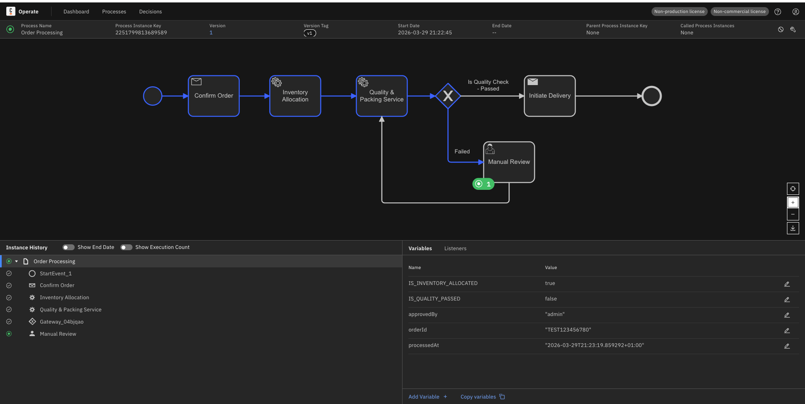

## Camunda 8 and Spring Boot 3.x integration example with external service tasks and receive tasks.

This repo contains a sample Spring Boot application that demonstrates how to integrate with Camunda 8 using the Zeebe client. It includes examples of external service tasks and receive tasks, showcasing how to interact with the Camunda engine from a Spring Boot application.

## Java version

- Default build/runtime: **Java 21**
- Optional fallback: **Java 17** via Maven profile `java17`


## Exploring the Camunda 8 features with a sample order processing workflow

1. Start Camunda instance in your local using 

Download the latest - https://docs.camunda.io/docs/self-managed/quickstart/developer-quickstart/c8run/

    ```shell
        cd c8run-8*
        ./start.sh
    ```

2. Install Camunda Modeler
    [Camunda Modeler](https://camunda.com/download/modeler/)

3. Deploy BPMN file using modeler - ```resource/order-process-v2.bpmn```

4. Deploy the process definition using Camunda Rest API

    ```shell
        curl -X POST http://localhost:8080/engine-rest/deployment/create \
          --user demo:demo \
          -H "Content-Type: multipart/form-data" \
          -F "deployment-name=order-processing.bpmn" \
          -F "data=@./src/main/resources/order-processing.bpmn"
    ```

5. Start a process instance using Camunda UI - tasklist option.


## Receive task example

1. Deploy and Start the process using Camunda modeler or Curl command as mentioned above.
2. Process waits at the `Receive Task` until it receives the message with name `Message_Confirmation` and correlationKey is `orderId`, you can trigger the message using below curl command or using Camunda UI - Message option.

3.

```shell
curl -X POST http://localhost:8080/v2/messages/publication \
     -H "Content-Type: application/json" \
     -d '{
           "name": "Message_Confirmation",
           "correlationKey": "123456789",
           "variables": {
             "approvedBy": "admin"
           },
           "timeToLive": 300000
         }'
```

4. Token will move forward to service-task and execute the logic in `processPacking` method and complete the process instance.

- Completing the service-tasks
```java
@JobWorker(type = "packingQueue")
public Map<String, Object> processPacking(final ActivatedJob job) {
    String orderId = job.getVariable(VAR_ORDER_ID).toString();
    boolean isQualityPassed = !orderId.startsWith("TEST");
    return createResponse(Map.of("IS_QUALITY_PASSED", isQualityPassed));
} 
```

5. *Refer below links for more information*

[Camunda Docker Image](https://hub.docker.com/r/camunda/camunda-bpm-platform/)

[Camunda Rest API](https://docs.camunda.org/manual/latest/reference/rest/)

[Fetch and Lock external task](https://docs.camunda.org/manual/latest/reference/rest/external-task/fetch/)

<h4>***NOTE: Implementation partially completed.***</h4>



