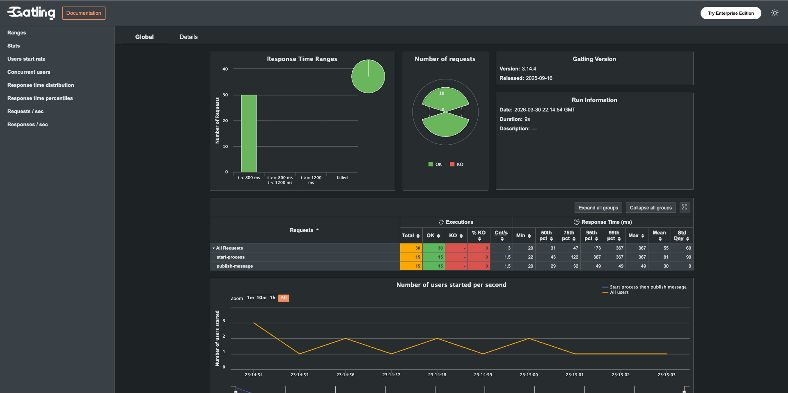

# Gatling Load Tests

This module runs a lightweight Gatling flow test against the Spring REST API:

1. `POST /api/processes/start`
2. `POST /api/processes/publish-message`

Each virtual user creates one `orderId` and reuses it as message `correlationKey` so both calls target the same process instance path.

## Prerequisites

- Application running on `http://localhost:8082`
- Process definition already deployed (default: `OrderProcessDefinition_v2`)

## Run

From repository root:

```bash
mvn -f gatling-load-tests/pom.xml gatling:test
```

Or from any folder using an absolute path:

```bash
mvn -f /absolute/path/to/camunda-java-integration/gatling-load-tests/pom.xml gatling:test
```

## Configurable Properties

Pass JVM properties with `-D` to tune the run:

- `baseUrl` (default `http://localhost:8082`)
- `users` (default `10`) - number of process flows to execute
- `rampSeconds` (default `5`) - if `0`, users start at once
- `pauseMillis` (default `50`) - pause between the two endpoint calls
- `processDefinitionId` (default `OrderProcessDefinition_v2`)
- `messageName` (default `Message_Confirmation`)
- `timeToLiveMillis` (default `300000`)

Example:

```bash
mvn -f ./gatling-load-tests/pom.xml gatling:test \
  -Dusers=15 \
  -DrampSeconds=10 \
  -DbaseUrl=http://localhost:8082 \
  -DprocessDefinitionId=OrderProcessDefinition_v2 \
  -DmessageName=Message_Confirmation
```

Gatling reports are generated under `gatling-load-tests/target/gatling`.

## Report Snapshot



Open the full interactive HTML report from the latest run in:

- `gatling-load-tests/target/gatling/<run-id>/index.html`

If you previously hit `Couldn't find a ComponentLibrary implementation`, pull latest `gatling-load-tests/pom.xml` and rerun with:

```bash
mvn -f gatling-load-tests/pom.xml clean gatling:test
```
